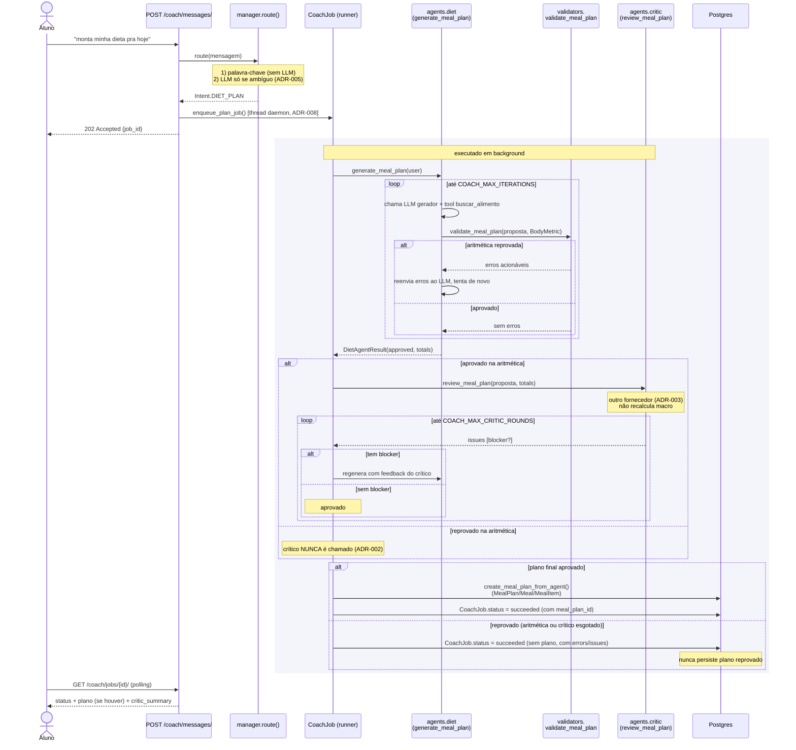
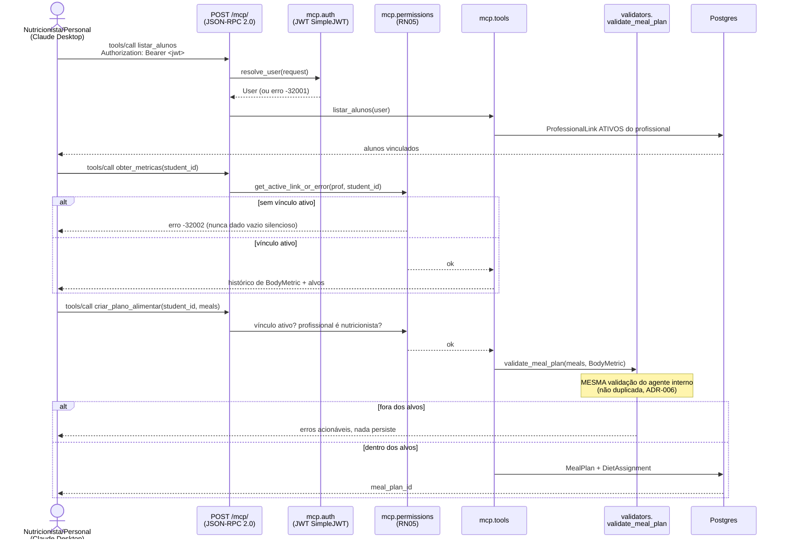

# Arquitetura — FitTrack Coach (`apps/coach`)

Leitura de 3 minutos. Para o *porquê* de cada decisão, ver
[`docs/adr/`](adr/README.md).

## Em uma frase

O Coach é um sistema multiagente onde **código decide, LLM propõe**: um
gerente determinístico roteia, um agente de dieta propõe usando ferramentas
sobre o catálogo real de alimentos, uma validação Python confere a
aritmética, um segundo LLM (fornecedor diferente) audita qualidade, e só
então o plano é persistido — tudo executado em segundo plano e consultável
por polling. Um servidor MCP separado expõe os mesmos dados e ferramentas
determinísticas a um host externo (Claude Desktop do profissional), sem
nenhum LLM do lado do FitTrack.

## Fluxo 1 — mensagem do aluno até o plano persistido

Toda chamada de LLM (gerente, dieta, crítico) grava um `AgentRun` —
provider, model, iterations, tokens, latência, `approved`,
`validation_errors`. É o log estruturado que torna o sistema depurável.

## Fluxo 2 — servidor MCP (host externo)

Nenhuma seta neste diagrama passa por `apps/coach/providers` ou
`apps/coach/agents` — o servidor MCP não chama LLM nenhum (ADR-006). Quem
raciocina sobre os dados é o modelo do lado do host (Claude Desktop); o
FitTrack só fornece dados e ferramentas determinísticas, com a mesma
checagem de vínculo (RN05) em toda ferramenta que toca um aluno.

## Onde cada peça mora

| Peça | Módulo |
|---|---|
| Roteamento determinístico + LLM de desambiguação | `apps/coach/agents/manager.py` |
| Geração de plano + loop de retry | `apps/coach/agents/diet.py` |
| Revisão de qualidade (fornecedor diferente) | `apps/coach/agents/critic.py` |
| Validação determinística (aritmética) | `apps/coach/validators.py` |
| Ferramentas do LLM gerador (`buscar_alimento`) | `apps/coach/tools.py` |
| Abstração de fornecedor (httpx puro) | `apps/coach/providers/` |
| Execução assíncrona (thread, dívida assumida) | `apps/coach/runner.py` |
| Endpoints REST (mensagens, jobs, histórico) | `apps/coach/views.py`, `urls.py` |
| Servidor MCP (host externo) | `apps/coach/mcp/` |
| Auditoria de cada chamada de LLM | `apps/coach/models.py` (`AgentRun`) |
